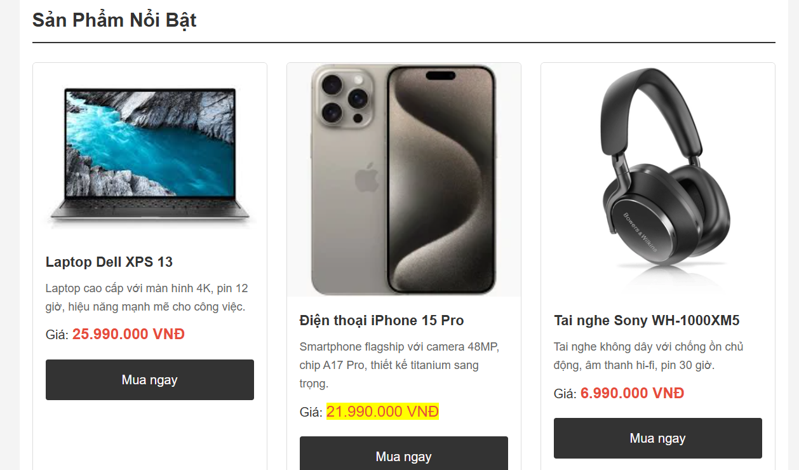
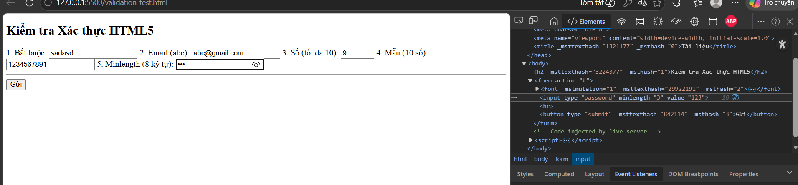

# Phần A
## Câu A1
1. text:Một ô trống một dòng để nhập ký tự tự do.Không có sẵn (trừ khi dùng thêm thuộc tính required hoặc pattern).	Nhập Tên sản phẩm hoặc Họ tên khách hàng.
2. password:	Các ký tự nhập vào biến thành dấu chấm hoặc dấu sao ẩn đi.	Tự động ẩn nội dung để bảo mật.	Nhập Mật khẩu khi đăng nhập/đăng ký tài khoản.
3. email:	Giống ô text nhưng có bàn phím tối ưu cho ký tự @.	Kiểm tra xem nội dung nhập vào có đúng định dạng email (phải có @ và tên miền) hay không.	Nhập Email nhận hóa đơn hoặc đăng ký nhận tin khuyến mãi.
4.	number:	Một ô nhập có nút mũi tên lên/xuống ở góc phải để tăng/giảm giá trị.	Chỉ cho phép nhập số; có thể giới hạn giá trị nhỏ nhất (min) và lớn nhất (max).	Chọn Số lượng sản phẩm muốn thêm vào giỏ hàng.
5.	date:	Hiển thị một ô có icon lịch, khi bấm vào sẽ hiện bảng chọn ngày/tháng/năm.	Đảm bảo người dùng nhập đúng định dạng ngày tháng hợp lệ.	Chọn Ngày sinh để nhận quà thành viên hoặc chọn Ngày giao hàng.

## Câu A2
1 <input type="text" required value="">
Dư đoán bị chặn lại (Lỗi)	Thuộc tính required bắt buộc ô này không được để trống. Trình duyệt sẽ hiện thông báo "Vui lòng điền vào ô này".    
2 
<input type="email" value="abc">
Dự đoán bị chặn lại (Lỗi)	type="email" yêu cầu phải có định dạng email hợp lệ (phải có dấu @). Chữ "abc" thiếu @ nên bị coi là sai định dạng.
3
<input type="number" min="1" max="10" value="15">
Dự đoán bị chặn lại (Lỗi)	Thuộc tính max="10" giới hạn giá trị lớn nhất là 10. Con số 15 vượt quá giới hạn này nên trình duyệt sẽ báo lỗi.    
4
<input type="text" pattern="[0-9]{10}" value="abc123">
Dự đoán bị chặn lại (Lỗi)	pattern="[0-9]{10}" yêu cầu phải nhập đúng 10 chữ số. Chuỗi "abc123" chứa chữ cái và không đủ độ dài nên không khớp với RegEx.
5
<input type="password" minlength="8" value="123">
Dự đoán bị chặn lại (Lỗi)minlength="8" yêu cầu mật khẩu phải có ít nhất 8 ký tự. Chuỗi "123" chỉ có 3 ký tự nên quá ngắn.

So sánh kết quả:
Khi chạy file trên và bấm Submit,  HTML5 chặn hoàn toàn việc gửi dữ liệu.
Nhưng trình duyệt không báo lỗi tất cả các ô cùng 1 lúc  , nó kiểm tra tuần tự từ trên xuống dưới khi bấm Submit lần đầu, một  thông báo lỗi  sẽ chỉ xuất hiện ở trường hợp đầu tiên, phải đến khi bạn nhập dữ liệu hợp lệ cho ô số 1 và bấm Submit lại, nó mới chuyển sang chặn và báo lỗi ở ô số 2, và tiếp tục như vậy cho đến hết form.

## Câu A3
1. Người dùng khiếm thị không dùng chuột để trỏ vào ô nhập liệu, họ dùng phím Tab để nhảy từ ô này sang ô khác. Trình đọc màn hình Screen Reader sẽ đọc to nội dung của ô mà họ đang đứng.

Nếu KHÔNG có <label for="id"> kết nối: Khi user tab vào ô email, máy sẽ chỉ đọc một cách vô hồn: "Edit text" (Ô nhập văn bản). Người dùng sẽ không biết phải nhập cái gì vào đây , định dạng nào (Tên? Tuổi? hay Email?).

Nếu CÓ <label for="email"> kết nối với <input id="email">: Mối liên kết này được báo cho trình duyệt biết ở tầng code. Khi user tab vào ô, máy sẽ đọc chính xác: "Email, edit text".

Với người dùng bình thường (đặc biệt trên điện thoại), việc liên kết này giúp họ bấm vào dòng chữ "Email" thì con trỏ chuột cũng tự động nhảy vào ô nhập liệu, tăng trải nghiệm người dùng (UX) rất nhiều.
( đối chiếu mục 3: "Accessibility — Form cho mọi người",
<input type="password" id="pwd" 
       aria-describedby="pwd-hint">)
       (đối chiếu mục 7: " Common Misconceptions — Hiểu sai phổ biến" Hiểu sai	Sự thật
"placeholder thay thế được <label>"	Không — placeholder biến mất khi gõ, screen reader không đọc placeholder làm label, accessibility fail , "Thiếu <label> cũng được, user vẫn thấy placeholder"	Người dùng screen reader nghe: "edit text" — không biết nhập gì. WCAG yêu cầu tất cả form control phải có accessible label )
(đối chiếu Mục 8: "Checkpoint" , nếu for và id không match: click vào label không focus vào input (UX xấu), và screen reader không biết label thuộc về input nào. Kết quả: người khiếm thị không dùng được form)

2. 
Cặp thẻ <fieldset> và <legend> được sử dụng trong 2 trường hợp chính:

Nhóm các ô nhập liệu (inputs) có liên quan chung một chủ đề lại với nhau (ví dụ: nhóm thông tin giao hàng).

Đặc biệt quan trọng để nhóm các nút radio buttons (chọn 1) hoặc checkboxes (chọn nhiều). <legend> sẽ đóng vai trò là "câu hỏi lớn" cho toàn bộ nhóm đó, giúp Screen Reader đọc một cách mạch lạc thay vì đọc từng nút rời rạc.

Dẫn chứng trong Chương 07:

Dẫn chứng 1 (Mục 3 - phần Code Form hoàn chỉnh): Dùng để nhóm Checkbox.

HTML
<fieldset>
    <legend>Phương thức nhận thông báo</legend>
    <label><input type="checkbox" name="notify" value="email" checked> Qua Email</label>
    <label><input type="checkbox" name="notify" value="sms"> Qua SMS</label>
</fieldset>
Dẫn chứng 2 (Mục 3 - phần Accessibility): Dùng để nhóm thông tin liên quan.

HTML
<fieldset>
    <legend>Thông tin giao hàng</legend>
    <label for="street">Đường:</label>
    <input type="text" id="street" name="street">
</fieldset>
Dẫn chứng 3 (Mục 6 - Hands-on Practice): Bắt buộc dùng cho Radio button.

"6. Giới tính: type="radio" (Nam / Nữ / Khác) trong <fieldset>"
Checklist: "[ ] Nhóm radio trong <fieldset> + <legend>"

Dẫn chứng 4 (Mục 9 - Summary): Được chốt lại như một nguyên tắc vàng.

"4. fieldset + legend = cách đúng để nhóm radio buttons và checkboxes liên quan"

3. 
Giải thích:

Dùng khi nào: aria-label được sử dụng để cung cấp một "nhãn ẩn" cho các thành phần không có chữ (text) hiển thị trên màn hình, ví dụ như một nút bấm chỉ có icon (biểu tượng giỏ hàng, kính lúp tìm kiếm). Nó giúp trình đọc màn hình biết chức năng của nút đó là gì.

Tại sao KHÔNG dùng khi đã có <label>: Trong HTML, <label> là thẻ ngữ nghĩa chuẩn mực nhất để đặt tên cho ô nhập liệu. Nếu bạn đã có <label>, việc nhét thêm aria-label là thừa thãi, làm rối code, và tệ hơn là có thể khiến trình đọc màn hình bị "đè" thông tin (nó có thể bỏ qua <label> và chỉ đọc aria-label, gây mất đồng bộ nếu hai nội dung này khác nhau).

Dẫn chứng trong Chương 07:
Tài liệu thể hiện quy tắc này rất rõ ràng thông qua ví dụ thực hành ở phần Accessibility:

Dẫn chứng (Mục 3 - Phần Accessibility):

HTML
<button type="submit" aria-label="Gửi đơn hàng">
    🛒
</button> 
(Tác giả bài giảng cố tình dùng icon chiếc xe đẩy  không có chữ viết. Vì mắt thường nhìn thấy xe đẩy thì hiểu là mua hàng, nhưng máy đọc màn hình không "nhìn" được xe đẩy, nên tác giả mới gắn aria-label="Gửi đơn hàng" để máy đọc to câu này lên).

## Câu A4
1. Thuộc tính loading="lazy" trên thẻ 
Giải thích: Đây là tính năng "Tải lười biếng". Khi gắn thuộc tính này, trình duyệt sẽ không tải bức ảnh ngay lập tức khi mở trang web. Nó sẽ chỉ bắt đầu tải bức ảnh đó khi người dùng cuộn chuột (scroll) đến gần vị trí bức ảnh.

Nó cải thiện gì? * Tốc độ tải trang (Page Load Speed): Trang web hiển thị nội dung đầu tiên cực kỳ nhanh vì không phải chờ tải hàng chục bức ảnh bên dưới.

Tiết kiệm băng thông (Bandwidth): Nếu người dùng vào trang nhưng không cuộn xuống dưới cùng, hệ thống sẽ không phải tải các bức ảnh ở cuối trang, giúp tiết kiệm data 4G cho user và chi phí server cho doanh nghiệp.

Khi nào KHÔNG nên dùng?

Tuyệt đối không dùng cho các ảnh nằm "Above the fold" (trong màn hình đầu tiên): Ví dụ như Logo, ảnh Banner to đùng ở đầu trang, ảnh sản phẩm chính.

Lý do: Những ảnh này người dùng cần nhìn thấy ngay lập tức khi vừa mở web. Nếu cài lazy, trình duyệt sẽ bị "chậm một nhịp" để tính toán xem có nên tải hay không, làm trải nghiệm bị giật, lag ở ngay giây đầu tiên.

2. Thẻ <video> và nhiều <source>
Tại sao nên cung cấp nhiều <source>?

Vấn đề lớn nhất của web là Khả năng tương thích trình duyệt (Browser Compatibility). Trình duyệt Chrome có thể thích định dạng này, nhưng Safari trên iPhone lại chuộng định dạng khác.

Khi bạn cung cấp nhiều <source>, trình duyệt sẽ đọc từ trên xuống dưới. Nó hỗ trợ định dạng nào đầu tiên thì nó sẽ lấy cái đó và bỏ qua các cái còn lại. Việc này đảm bảo video của bạn xem được trên 100% các thiết bị.

3 Format video web phổ biến:

MP4 (video/mp4): Phổ biến nhất, tương thích mọi trình duyệt. Chất lượng tốt nhưng dung lượng hơi nặng.

WebM (video/webm): Do Google phát triển, tối ưu cực tốt cho web (dung lượng nhỏ, chất lượng cao). Chạy mượt trên Chrome, Firefox.

Ogg (video/ogg): Định dạng mã nguồn mở, hỗ trợ tốt trên các trình duyệt cũ hơn hoặc hệ điều hành Linux.

3. 

Accessibility (Khả năng tiếp cận): Trình đọc màn hình (Screen Reader) sẽ đọc nội dung này cho người khiếm thị nghe.

SEO (Tối ưu công cụ tìm kiếm): Google Bot không "nhìn" được ảnh, nó đọc thuộc tính alt để hiểu ảnh đó nói về cái gì và xếp hạng từ khóa.

Fallback (Dự phòng): Nếu mạng quá chậm hoặc link ảnh bị hỏng, chữ trong alt sẽ hiển thị ra để người dùng biết chỗ đó từng có bức ảnh gì.

Viết alt tốt cho 3 trường hợp:

Trường hợp 1: Ảnh sản phẩm iPhone 16 (Dành cho SEO & Bán hàng)

 alt="Điện thoại Apple iPhone 16 màu Titan tự nhiên, mặt lưng kính, dung lượng 256GB"

                
            

Trường hợp 2: Ảnh trang trí (decorative - ví dụ: hoa văn viền, icon lấp lánh)

 alt=""
 

                
            

            
(để trống không đọc đối với ảnh trang trí)  
Trường hợp 3: Ảnh biểu đồ doanh thu Q1/2026

                
            

    

## Câu A5
Cách 1 ( đứng độc lập): Chỉ đơn thuần là chèn một bức ảnh vào trang web. Nó giống như một "danh từ" trong câu.
Dùng khi bức ảnh chỉ đóng vai trò minh họa đơn thuần, hoặc là một phần của nội dung mà không cần chú thích bằng chữ ngay bên dưới. Nếu xóa bức ảnh đi, nội dung văn bản xung quanh vẫn đủ ý nghĩa. (ví dụ ảnh đại diện ava , icon hoặc logo trang web )
Cách 2 (<figure> + <figcaption>): Là một đơn vị nội dung hoàn chỉnh. Nó bao gồm bức ảnh và phần chú thích đi kèm. Cặp thẻ này báo hiệu cho trình duyệt và Google biết rằng: "Đây là một tổ hợp gồm ảnh và mô tả, chúng đi cùng nhau và bổ trợ cho nhau". 
Dùng khi bức ảnh là một đối tượng quan trọng cần được giải thích, chú thích rõ ràng. Đặc biệt là khi bạn muốn tách biệt khối ảnh này ra khỏi luồng văn bản (giống như các hình minh họa trong sách giáo khoa)
Ví dụ ảnh sản phẩm chi tiết, giao diện làm phần PBT_01

<figure>

 </figure>

# Phần C
## C1
<form>
    Tên: <input type="text">
    
    <input type="email" placeholder="Email của bạn">
    
    <input type="password" placeholder="Mật khẩu">
    <input type="password" placeholder="Nhập lại mật khẩu">
    
    Phone: <input type="text" value="0901234567">
    
    <select>
        <option>Hà Nội</option>
        <option>TP.HCM</option>
    </select>
    
    <label>
        Tôi đồng ý điều khoản
    </label>
    
    <input type="submit" value="Gửi">
</form>

1. Lỗi 1: Dòng 1 — Thẻ <form> thiếu thuộc tính method="POST"
Mặc định form sẽ dùng phương thức GET, điều này sẽ đẩy cả Mật khẩu và Email hiển thị trần trụi trên thanh URL, vi phạm bảo mật nghiêm trọng.
Sửa:

<form action="/api/submit" method="POST">

2. 
Lỗi 2: Dòng 2 — Input "Tên" không có <label for="...">, thiếu name và required
Viết text trơn "Tên:" làm nhãn là vi phạm accessibility (Screen Reader không hiểu). Đồng thời thiếu name khiến data không thể gửi lên server, thiếu required làm hỏng validation.
Sửa:

<label for="fullname">Tên:</label> 
<input type="text" id="fullname" name="fullname" required>

3. 
Lỗi 3: Dòng 4 — Dùng placeholder thay thế cho thẻ <label> ở input Email
Lạm dụng placeholder làm nhãn là một thói quen xấu (WCAG fail) vì khi gõ chữ, nhãn sẽ biến mất. Thiếu liên kết id và name.
Sửa:

<label for="email">Email:</label> 
<input type="email" id="email" name="email" placeholder="Email của bạn" required>

4. 
Lỗi 4: Dòng 6, 7 — Ô Password thiếu <label>, thiếu name và không có Validation độ dài
Thiếu minlength khiến người dùng có thể nhập mật khẩu 1 ký tự. Đồng thời phải bọc label đàng hoàng cho cả 2 ô.
Sửa:

<label for="pwd">Mật khẩu:</label> 
<input type="password" id="pwd" name="password" placeholder="Mật khẩu" minlength="8" required>

<label for="pwd_confirm">Nhập lại mật khẩu:</label> 
<input type="password" id="pwd_confirm" name="pwd_confirm" placeholder="Nhập lại mật khẩu" minlen

Lỗi 5: Dòng 9 — Input Phone dùng sai type, lạm dụng value và thiếu validation
Dùng type="text" sẽ không gọi được bàn phím số ưu tiên trên điện thoại (vi phạm UX/Accessibility). Dùng value="0901234567" sẽ gán cứng dữ liệu vào ô, ép người dùng phải xóa đi mới nhập được. Đồng thời, thiếu pattern để kiểm tra định dạng số điện thoại hợp lệ.

<label for="phone">Phone:</label> 
<input type="tel" id="phone" name="phone" placeholder="0901234567" pattern="0[35789][0-9]{8}" required>

6. 
Lỗi 6: Dòng 11 — Thẻ <select> thiếu <label>, name và Option rỗng mặc định
Thiếu name nên server không nhận được dữ liệu. Thiếu một <option> rỗng đầu tiên (như "Chọn thành phố") sẽ khiến thẻ này luôn mặc định gửi đi "Hà Nội" ngay cả khi người dùng quên chưa chạm vào ô này.
Sửa:

<label for="city">Thành phố:</label>
<select id="city" name="city" required>
    <option value="">-- Chọn thành phố --</option>
    <option value="HN">Hà Nội</option>
    <option value="HCM">TP.HCM</option>
</select>

7. 
Lỗi 7: Dòng 16, 17, 18 — Thẻ <label> điều khoản không chứa thẻ <input> nào
Viết thẻ <label> nhưng lại... quên không nhúng thẻ <input type="checkbox"> vào bên trong (hoặc dùng for), khiến người dùng không có hộp kiểm nào để click xác nhận.
Sửa:

<label>
    <input type="checkbox" name="agree" required> Tôi đồng ý điều khoản
</label>

8. 
Lỗi 8: Dòng 20 — Nút gửi dùng <input type="submit"> 
Dù <input type="submit"> chạy được, nhưng theo Best Practices hiện đại (HTML5), nút bấm trong form nên dùng thẻ <button type="submit">. Thẻ button giúp bạn dễ dàng chèn icon, style CSS linh hoạt hơn và chuẩn Semantic.
Sửa

<button type="submit">Gửi</button>

## Câu C2
1. Viết pattern regex cho CMND/CCCD và Số tài khoản

CMND/CCCD (Đúng 12 chữ số):(ví dụ 001205017084 có 12 chữ số)

HTML
<input type="text" pattern="[0-9]{12}" required title="CCCD phải bao gồm đúng 12 chữ số">
Số tài khoản (Từ 10 đến 15 chữ số):

HTML
<input type="text" pattern="[0-9]{10,15}" required title="Số tài khoản phải từ 10 đến 15 chữ số">

email đúng format
<input type="email" id="email" name="email" required>
mã pin 6 chữ số
 <input type="password" pattern="[0-9]{6}" required> 

2. HTML5 validation đủ an toàn cho ứng dụng ngân hàng chưa? Tại sao?
Không đủ an toàn

Tại sao?
HTML5 Validation là cơ chế kiểm tra diễn ra hoàn toàn ở Client-side (trên trình duyệt của người dùng). Nó sinh ra chỉ để mang lại trải nghiệm người dùng (UX) tốt hơn, giúp báo lỗi nhanh mà không cần tải lại trang.
Tuy nhiên, nó rất dễ bị qua mặt. Một người dùng bình thường chỉ cần nhấn F12 (Mở DevTools), tìm đến thẻ <input> và xóa bỏ các thuộc tính như required, pattern, maxlength... Sau đó, họ có thể submit bất cứ dữ liệu rác nào lên server.
(ví dụ:
Bạn tải trang web đăng ký về máy. Ô số tài khoản yêu cầu nhập số và bị giới hạn 15 ký tự (maxlength="15").Bạn mở DevTools, xóa chữ maxlength="15" .Bạn copy một bài văn dài 1000 chữ dán vào ô số tài khoản, bạn bấm gửi.Trình duyệt kiểm tra lại HTML. Vì chữ maxlength đã bị bạn xóa ở bước 2, trình duyệt thấy ô này hoàn toàn hợp lệ. Nó lập tức đóng gói bài văn 1000 chữ đó và bắn thẳng lên Server. Kết quả: HTML5 Validation đã bị qua mặt thành công 100%. Gói tin chứa dữ liệu rác đã được gửi đi.Nếu lúc này, Backend (đang nằm trên máy chủ của ngân hàng) không chịu kiểm tra lại xem dữ liệu nhận được có đúng là số hay không mà cứ thế lưu thẳng vào Database, thì Database sẽ bị lỗi, hoặc nghiêm trọng hơn là bị sập hệ thống do tràn bộ nhớ.)
Ví dụ cơ bản: Xóa minlength từ 8 thành 3 ký tự bằng devtools vẫn submit được 

3. 3 loại validation mà HTML5 KHÔNG THỂ làm được (Phải dùng JavaScript)
HTML5 rất tiện nhưng lại bị "cứng", không xử lý được các logic động. Bạn bắt buộc phải dùng JavaScript cho các trường hợp sau:

Xác thực chéo (Cross-field Validation): HTML5 không thể so sánh giá trị của hai ô khác nhau. Ví dụ: Ô "Nhập lại mật khẩu" phải giống hệt ô "Mật khẩu" ở trên, hoặc "Ngày kết thúc" không được nhỏ hơn "Ngày bắt đầu".

Kiểm tra tính hợp lệ của nghiệp vụ (Business Logic): HTML5 có thể chặn người dùng nhập chữ vào ô Ngày sinh, nhưng nó không thể tính toán để cấm người dùng dưới 18 tuổi đăng ký tài khoản tín dụng. JS cần thiết để lấy ngày hiện tại trừ đi ngày sinh và đưa ra quyết định.

Xác thực bất đồng bộ (Asynchronous Validation): HTML5 không thể biết Email hoặc số CCCD này đã tồn tại trong cơ sở dữ liệu hay chưa. JavaScript (thông qua AJAX/Fetch) sẽ phải gửi một request ngầm xuống server để kiểm tra trùng lặp và báo lỗi ngay lập tức trên giao diện mà không cần Submit form.

4. Nêu 2 rủi ro bảo mật nếu chỉ validate trên Frontend mà không validate Backend
Nếu lập trình viên Backend chủ quan, tin tưởng 100% vào dữ liệu Frontend gửi lên, ứng dụng ngân hàng sẽ phải đối mặt với các rủi ro tàn khốc:

Rủi ro phá hủy cơ sở dữ liệu (SQL Injection / XSS):
Nếu không có Backend Validation để làm sạch (sanitize) dữ liệu, hacker có thể gửi các đoạn mã độc SQL (ví dụ: '; DROP TABLE Users; --) hoặc mã JavaScript độc hại thay vì tên đăng nhập. Khi Backend  chạy đoạn mã này, toàn bộ dữ liệu ngân hàng có thể bị xóa trắng hoặc bị đánh cắp.

Rủi ro thao túng nghiệp vụ tài chính (Data Manipulation):
Hacker có thể chặn request gửi đi và sửa đổi dữ liệu. Ví dụ: Ở Frontend, form chỉ cho phép chuyển tiền lớn hơn 0. Nhưng hacker có thể sửa gói tin thành chuyển đi -100.000.000 VNĐ. Nếu Backend không kiểm tra lại điều kiện (số tiền > 0), hacker sẽ nghiễm nhiên được cộng thêm 100 triệu vào tài khoản (vì trừ đi số âm là cộng). Đây là lỗ hổng chí mạng trong Fintech.
 Frontend Validation là để chiều lòng người dùng (UX), Backend Validation mới là tấm khiên bảo vệ hệ thống. Luôn phải Validate ở cả 2 nơi!

