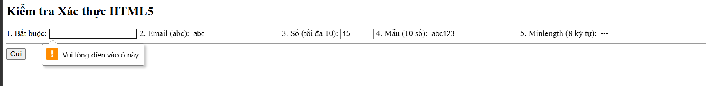
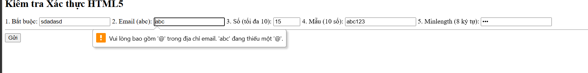
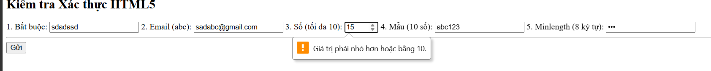
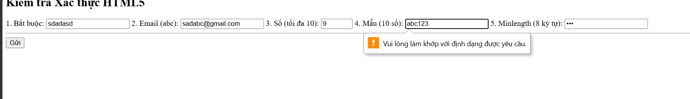
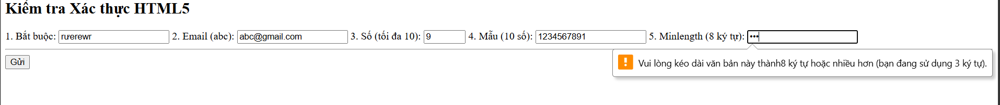
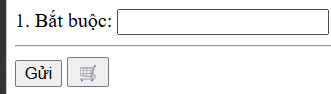
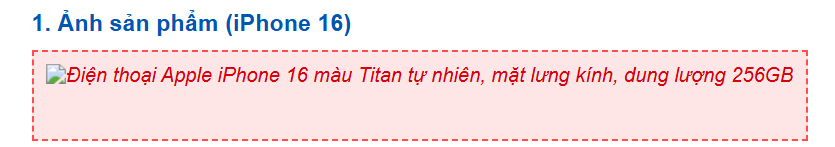
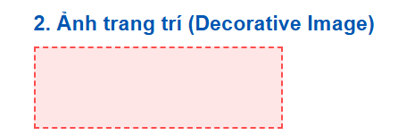
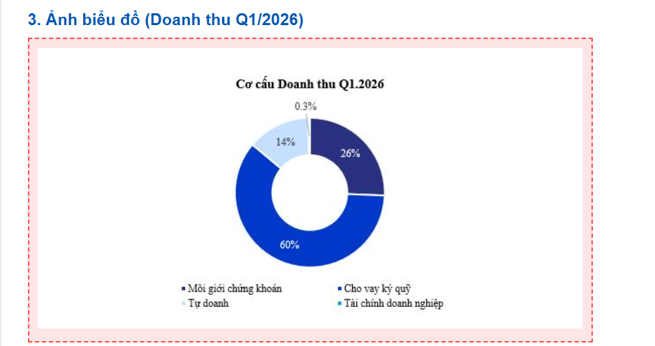

# Phần A
## Câu A1
1. text:Một ô trống một dòng để nhập ký tự tự do.Không có sẵn (trừ khi dùng thêm thuộc tính required hoặc pattern).	Nhập Tên sản phẩm hoặc Họ tên khách hàng.
2. password:	Các ký tự nhập vào biến thành dấu chấm hoặc dấu sao ẩn đi.	Tự động ẩn nội dung để bảo mật.	Nhập Mật khẩu khi đăng nhập/đăng ký tài khoản.
3. email:	Giống ô text nhưng có bàn phím tối ưu cho ký tự @.	Kiểm tra xem nội dung nhập vào có đúng định dạng email (phải có @ và tên miền) hay không.	Nhập Email nhận hóa đơn hoặc đăng ký nhận tin khuyến mãi.
4.	number:	Một ô nhập có nút mũi tên lên/xuống ở góc phải để tăng/giảm giá trị.	Chỉ cho phép nhập số; có thể giới hạn giá trị nhỏ nhất (min) và lớn nhất (max).	Chọn Số lượng sản phẩm muốn thêm vào giỏ hàng.
5.	date:	Hiển thị một ô có icon lịch, khi bấm vào sẽ hiện bảng chọn ngày/tháng/năm.	Đảm bảo người dùng nhập đúng định dạng ngày tháng hợp lệ.	Chọn Ngày sinh để nhận quà thành viên hoặc chọn Ngày giao hàng.

## Câu A2
1 <input type="text" required value="">
Dư đoán bị chặn lại (Lỗi)	Thuộc tính required bắt buộc ô này không được để trống. Trình duyệt sẽ hiện thông báo "Vui lòng điền vào ô này".    
2 
<input type="email" value="abc">
Dự đoán bị chặn lại (Lỗi)	type="email" yêu cầu phải có định dạng email hợp lệ (phải có dấu @). Chữ "abc" thiếu @ nên bị coi là sai định dạng.
3
<input type="number" min="1" max="10" value="15">
Dự đoán bị chặn lại (Lỗi)	Thuộc tính max="10" giới hạn giá trị lớn nhất là 10. Con số 15 vượt quá giới hạn này nên trình duyệt sẽ báo lỗi.    
4
<input type="text" pattern="[0-9]{10}" value="abc123">
Dự đoán bị chặn lại (Lỗi)	pattern="[0-9]{10}" yêu cầu phải nhập đúng 10 chữ số. Chuỗi "abc123" chứa chữ cái và không đủ độ dài nên không khớp với RegEx.
5
<input type="password" minlength="8" value="123">
Dự đoán bị chặn lại (Lỗi)minlength="8" yêu cầu mật khẩu phải có ít nhất 8 ký tự. Chuỗi "123" chỉ có 3 ký tự nên quá ngắn.

So sánh kết quả:
Khi chạy file trên và bấm Submit,  HTML5 chặn hoàn toàn việc gửi dữ liệu.
Nhưng trình duyệt không báo lỗi tất cả các ô cùng 1 lúc  , nó kiểm tra tuần tự từ trên xuống dưới khi bấm Submit lần đầu, một  thông báo lỗi  sẽ chỉ xuất hiện ở trường hợp đầu tiên, phải đến khi bạn nhập dữ liệu hợp lệ cho ô số 1 và bấm Submit lại, nó mới chuyển sang chặn và báo lỗi ở ô số 2, và tiếp tục như vậy cho đến hết form.

## Câu A3
1. Người dùng khiếm thị không dùng chuột để trỏ vào ô nhập liệu, họ dùng phím Tab để nhảy từ ô này sang ô khác. Trình đọc màn hình Screen Reader sẽ đọc to nội dung của ô mà họ đang đứng.

Nếu KHÔNG có <label for="id"> kết nối: Khi user tab vào ô email, máy sẽ chỉ đọc một cách vô hồn: "Edit text" (Ô nhập văn bản). Người dùng sẽ không biết phải nhập cái gì vào đây , định dạng nào (Tên? Tuổi? hay Email?).

Nếu CÓ <label for="email"> kết nối với <input id="email">: Mối liên kết này được báo cho trình duyệt biết ở tầng code. Khi user tab vào ô, máy sẽ đọc chính xác: "Email, edit text".

Với người dùng bình thường (đặc biệt trên điện thoại), việc liên kết này giúp họ bấm vào dòng chữ "Email" thì con trỏ chuột cũng tự động nhảy vào ô nhập liệu, tăng trải nghiệm người dùng (UX) rất nhiều.
( đối chiếu mục 3: "Accessibility — Form cho mọi người",
<input type="password" id="pwd" 
       aria-describedby="pwd-hint">)
       (đối chiếu mục 7: " Common Misconceptions — Hiểu sai phổ biến" Hiểu sai	Sự thật
"placeholder thay thế được <label>"	Không — placeholder biến mất khi gõ, screen reader không đọc placeholder làm label, accessibility fail , "Thiếu <label> cũng được, user vẫn thấy placeholder"	Người dùng screen reader nghe: "edit text" — không biết nhập gì. WCAG yêu cầu tất cả form control phải có accessible label )
(đối chiếu Mục 8: "Checkpoint" , nếu for và id không match: click vào label không focus vào input (UX xấu), và screen reader không biết label thuộc về input nào. Kết quả: người khiếm thị không dùng được form)

2. 
Cặp thẻ <fieldset> và <legend> được sử dụng trong 2 trường hợp chính:

Nhóm các ô nhập liệu (inputs) có liên quan chung một chủ đề lại với nhau (ví dụ: nhóm thông tin giao hàng).

Đặc biệt quan trọng để nhóm các nút radio buttons (chọn 1) hoặc checkboxes (chọn nhiều). <legend> sẽ đóng vai trò là "câu hỏi lớn" cho toàn bộ nhóm đó, giúp Screen Reader đọc một cách mạch lạc thay vì đọc từng nút rời rạc.

Dẫn chứng trong Chương 07:

Dẫn chứng 1 (Mục 3 - phần Code Form hoàn chỉnh): Dùng để nhóm Checkbox.

HTML
<fieldset>
    <legend>Phương thức nhận thông báo</legend>
    <label><input type="checkbox" name="notify" value="email" checked> Qua Email</label>
    <label><input type="checkbox" name="notify" value="sms"> Qua SMS</label>
</fieldset>
Dẫn chứng 2 (Mục 3 - phần Accessibility): Dùng để nhóm thông tin liên quan.

HTML
<fieldset>
    <legend>Thông tin giao hàng</legend>
    <label for="street">Đường:</label>
    <input type="text" id="street" name="street">
</fieldset>
Dẫn chứng 3 (Mục 6 - Hands-on Practice): Bắt buộc dùng cho Radio button.

"6. Giới tính: type="radio" (Nam / Nữ / Khác) trong <fieldset>"
Checklist: "[ ] Nhóm radio trong <fieldset> + <legend>"

Dẫn chứng 4 (Mục 9 - Summary): Được chốt lại như một nguyên tắc vàng.

"4. fieldset + legend = cách đúng để nhóm radio buttons và checkboxes liên quan"

3. 
Giải thích:

Dùng khi nào: aria-label được sử dụng để cung cấp một "nhãn ẩn" cho các thành phần không có chữ (text) hiển thị trên màn hình, ví dụ như một nút bấm chỉ có icon (biểu tượng giỏ hàng, kính lúp tìm kiếm). Nó giúp trình đọc màn hình biết chức năng của nút đó là gì.

Tại sao KHÔNG dùng khi đã có <label>: Trong HTML, <label> là thẻ ngữ nghĩa chuẩn mực nhất để đặt tên cho ô nhập liệu. Nếu bạn đã có <label>, việc nhét thêm aria-label là thừa thãi, làm rối code, và tệ hơn là có thể khiến trình đọc màn hình bị "đè" thông tin (nó có thể bỏ qua <label> và chỉ đọc aria-label, gây mất đồng bộ nếu hai nội dung này khác nhau).

Dẫn chứng trong Chương 07:
Tài liệu thể hiện quy tắc này rất rõ ràng thông qua ví dụ thực hành ở phần Accessibility:

Dẫn chứng (Mục 3 - Phần Accessibility):

HTML
<button type="submit" aria-label="Gửi đơn hàng">
    🛒
</button> 
(Tác giả bài giảng cố tình dùng icon chiếc xe đẩy  không có chữ viết. Vì mắt thường nhìn thấy xe đẩy thì hiểu là mua hàng, nhưng máy đọc màn hình không "nhìn" được xe đẩy, nên tác giả mới gắn aria-label="Gửi đơn hàng" để máy đọc to câu này lên).

## Câu A4
1. Thuộc tính loading="lazy" trên thẻ 
Giải thích: Đây là tính năng "Tải lười biếng". Khi gắn thuộc tính này, trình duyệt sẽ không tải bức ảnh ngay lập tức khi mở trang web. Nó sẽ chỉ bắt đầu tải bức ảnh đó khi người dùng cuộn chuột (scroll) đến gần vị trí bức ảnh.

Nó cải thiện gì? * Tốc độ tải trang (Page Load Speed): Trang web hiển thị nội dung đầu tiên cực kỳ nhanh vì không phải chờ tải hàng chục bức ảnh bên dưới.

Tiết kiệm băng thông (Bandwidth): Nếu người dùng vào trang nhưng không cuộn xuống dưới cùng, hệ thống sẽ không phải tải các bức ảnh ở cuối trang, giúp tiết kiệm data 4G cho user và chi phí server cho doanh nghiệp.

Khi nào KHÔNG nên dùng?

Tuyệt đối không dùng cho các ảnh nằm "Above the fold" (trong màn hình đầu tiên): Ví dụ như Logo, ảnh Banner to đùng ở đầu trang, ảnh sản phẩm chính.

Lý do: Những ảnh này người dùng cần nhìn thấy ngay lập tức khi vừa mở web. Nếu cài lazy, trình duyệt sẽ bị "chậm một nhịp" để tính toán xem có nên tải hay không, làm trải nghiệm bị giật, lag ở ngay giây đầu tiên.

2. Thẻ <video> và nhiều <source>
Tại sao nên cung cấp nhiều <source>?

Vấn đề lớn nhất của web là Khả năng tương thích trình duyệt (Browser Compatibility). Trình duyệt Chrome có thể thích định dạng này, nhưng Safari trên iPhone lại chuộng định dạng khác.

Khi bạn cung cấp nhiều <source>, trình duyệt sẽ đọc từ trên xuống dưới. Nó hỗ trợ định dạng nào đầu tiên thì nó sẽ lấy cái đó và bỏ qua các cái còn lại. Việc này đảm bảo video của bạn xem được trên 100% các thiết bị.

3 Format video web phổ biến:

MP4 (video/mp4): Phổ biến nhất, tương thích mọi trình duyệt. Chất lượng tốt nhưng dung lượng hơi nặng.

WebM (video/webm): Do Google phát triển, tối ưu cực tốt cho web (dung lượng nhỏ, chất lượng cao). Chạy mượt trên Chrome, Firefox.

Ogg (video/ogg): Định dạng mã nguồn mở, hỗ trợ tốt trên các trình duyệt cũ hơn hoặc hệ điều hành Linux.

3. 

Accessibility (Khả năng tiếp cận): Trình đọc màn hình (Screen Reader) sẽ đọc nội dung này cho người khiếm thị nghe.

SEO (Tối ưu công cụ tìm kiếm): Google Bot không "nhìn" được ảnh, nó đọc thuộc tính alt để hiểu ảnh đó nói về cái gì và xếp hạng từ khóa.

Fallback (Dự phòng): Nếu mạng quá chậm hoặc link ảnh bị hỏng, chữ trong alt sẽ hiển thị ra để người dùng biết chỗ đó từng có bức ảnh gì.

Viết alt tốt cho 3 trường hợp:

Trường hợp 1: Ảnh sản phẩm iPhone 16 (Dành cho SEO & Bán hàng)

 alt="Điện thoại Apple iPhone 16 màu Titan tự nhiên, mặt lưng kính, dung lượng 256GB"

                
            

Trường hợp 2: Ảnh trang trí (decorative - ví dụ: hoa văn viền, icon lấp lánh)

 alt=""
 

                
            

            
(để trống không đọc đối với ảnh trang trí)  
Trường hợp 3: Ảnh biểu đồ doanh thu Q1/2026

                
            

    

